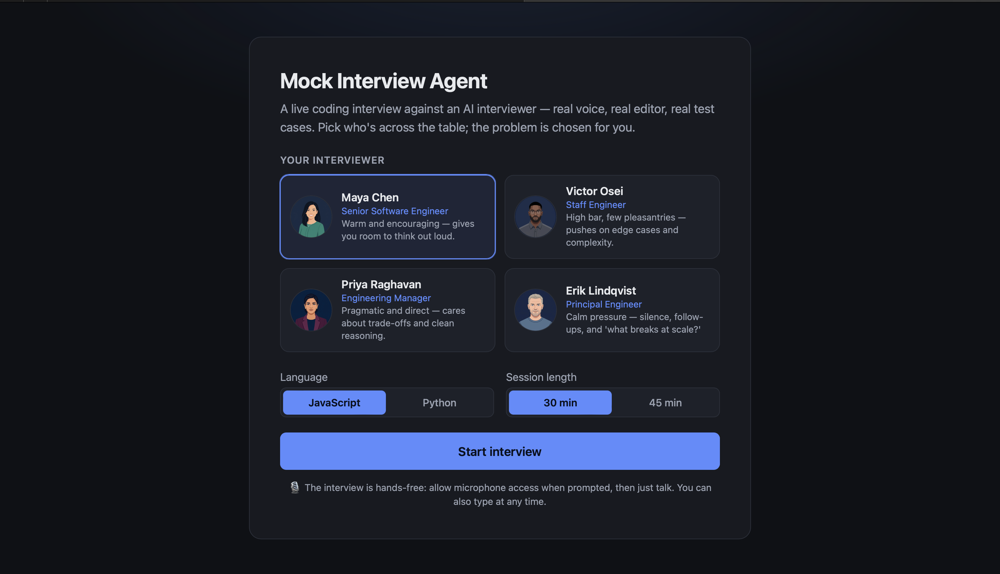
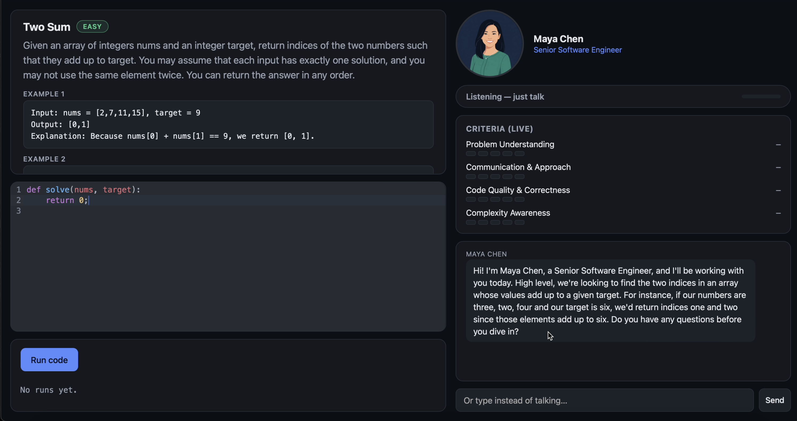
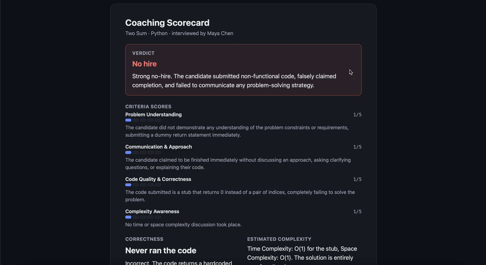

<div align="center">

# 🎯 Ace It!

### Face a tough interviewer before you face the real one.

An AI mock interviewer for coding (DSA) interviews. You talk to it out loud, write your
solution in a real editor, and it interviews you the way an actual engineer would — asking
follow-ups, pushing on edge cases, and reacting to your code as you go. When time's up, it
gives you an honest coaching scorecard, right down to a hire / no-hire call.

Built for the **AI for Ease** theme.


</div>

## The problem

Everyone tells you the best way to prepare for a coding interview is to do mock interviews.
The trouble is that a good one needs another person — someone who will actually push you,
ask "why this approach?", and not let you off the hook when you go quiet. That person is
hard to find, and even harder to find on demand at 11pm the night before.

**Ace It!** is that person, minus the scheduling. It's an interviewer you can practise with
whenever you want, as many times as you want.

## What it does

- **Pick your setup** — choose one of four interviewers (from warm and encouraging to calm
  and relentless), your language (JavaScript or Python), and how long you want the session
  to run. The problem is picked for you, like the real thing.
- **Just talk** — the interview is hands-free. You explain your thinking out loud and the
  interviewer replies in a natural voice. You can also type at any time.
- **Write real code** — a proper editor with syntax highlighting. Hit **Run** and your
  solution is tested against real cases in a sandbox.
- **Watch yourself in real time** — a live criteria panel updates as you go, so you can see
  how your problem understanding, communication, code quality, and complexity awareness are
  landing.
- **Get a real verdict** — at the end you get a coaching scorecard: scores per criterion, a
  story of how the interview went, your filler-word count, and an honest hire / no-hire call
  with reasons.

## Screenshots

**1. Pick who's across the table.** Four interviewers, from warm and encouraging to calm and relentless.



**2. The interview.** Read the problem, talk through your plan, write your code — the interviewer reacts as you go, and the criteria panel scores you live.



**3. The coaching scorecard.** An honest breakdown at the end, right down to a hire / no-hire call.



## How it works

Everything you say and everything in your editor is sent to **Google Gemini**, which plays
the interviewer and replies in character. The reply is spoken back to you through Google
Cloud **Text-to-Speech**. If Gemini can't read your microphone audio directly, we fall back
to Cloud **Speech-to-Text** and try again with the transcript — so voice keeps working
either way.

Under the hood, three coordinated roles share one running scorecard:

- **Interviewer** — reacts to each thing you say or run, in character.
- **Aggregator** — steps back on a timer and looks at the whole window, catching slow drift
  or long silences a single reply would miss.
- **Watchdog** — quietly watches for you going quiet or rambling, and nudges you like a real
  interviewer glancing up from their notes.

Your code runs entirely in your browser — JavaScript in a Web Worker, Python via Pyodide —
so there's no code-execution server and an infinite loop can only ever hang a throwaway
thread, never the page.

## Tech stack

- **Frontend** — plain ES modules with React and CodeMirror 6 loaded from a CDN. No build
  step, no bundler.
- **Backend** — a small Express server that proxies every Google call, so no API key ever
  reaches the browser.
- **Google AI** — Gemini (reasoning + avatar images), Cloud Text-to-Speech, Cloud
  Speech-to-Text.

## Getting started

### 1. Add your credentials

```bash
cp .env.example .env
```

Gemini and the voice APIs authenticate differently:

- **Gemini** (the interview itself) accepts a plain API key. Put `GEMINI_API_KEY` in `.env`
  and Gemini needs no Google Cloud project at all.
- **Voice** (Speech-to-Text + Text-to-Speech) does **not** accept API keys — this is
  confirmed against the live APIs, which reject them outright. Voice always needs
  **Application Default Credentials (ADC)**. Set `GCP_PROJECT_ID` in `.env` to a project
  with the Vertex AI, Speech-to-Text, and Text-to-Speech APIs enabled, then run once:

  ```bash
  bash <(curl -sSL https://storage.googleapis.com/cloud-samples-data/adc/setup_adc.sh)
  ```

  (This is the same as `gcloud auth application-default login`.)

> **In short:** if you want voice, you need ADC. A `GEMINI_API_KEY` only shortcuts the
> reasoning calls — it doesn't replace ADC.

### 2. Install and run

```bash
npm install
npm start
```

Open **http://localhost:8000** in **Chrome** (voice capture assumes Chrome/Edge/Firefox's
recording format — Safari uses a different codec).

Want to check your auth is set up before diving in?

```bash
curl http://localhost:8000/api/health
```

### Demo mode

Out of the box the app pins every session to one problem (Two Sum) so it's predictable to
show off. To use the full weighted question bank instead, set `FORCED_PROBLEM_ID = null` in
[`src/config.js`](src/config.js).

## Troubleshooting

- **"No Application Default Credentials found"** — re-run the `setup_adc.sh` command above,
  then restart the server.
- **"API keys are not supported by this API"** — you're hitting Speech-to-Text or
  Text-to-Speech without ADC. There's no API-key alternative for these two.
- **Voice quota / billing-project errors** — run
  `gcloud auth application-default set-quota-project YOUR_PROJECT_ID`.
- **Gemini calls return 404** — the model name (`GEMINI_MODEL`) may have moved on; check it
  against the current Gemini docs.

## Team — Ace It!

| Member | Role | What they worked on |
| --- | --- | --- |
| **Aayan** | Frontend | UI and the initial prototype |
| **Pieter** | Product Manager | Led the app design and UX decisions, and early project planning |
| **Sali** | AI Integration | Wiring the app up to Gemini |
| **Vedika** | Frontend | UI and the initial prototype |
| **Yurii** | Backend | AI integration and text-to-speech |

<div align="center">
<br>
Made with ☕ and too many mock interviews.
</div>
