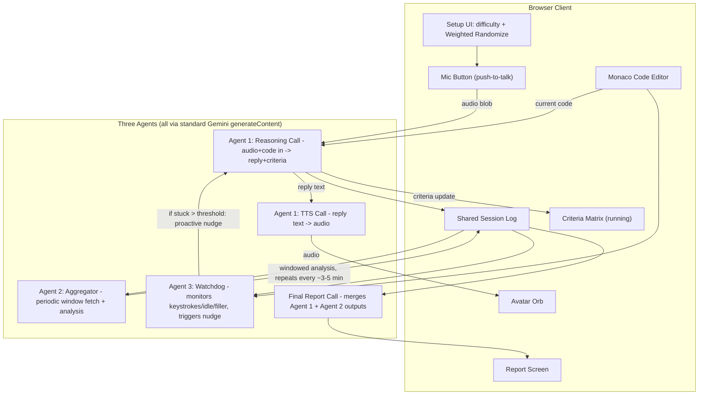
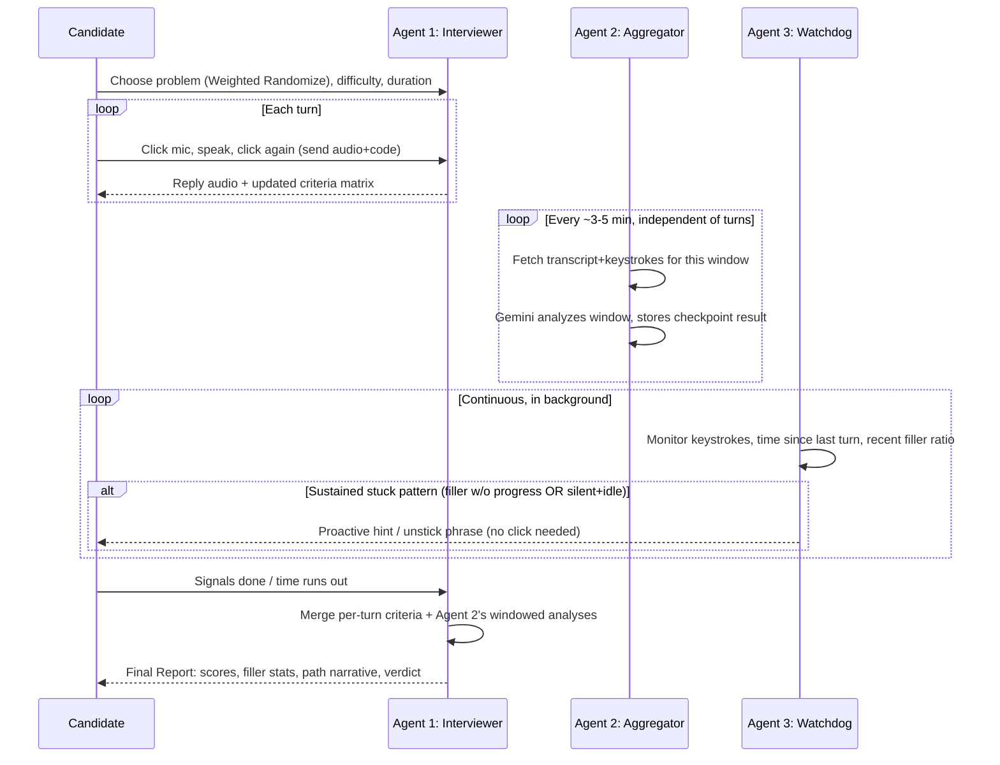
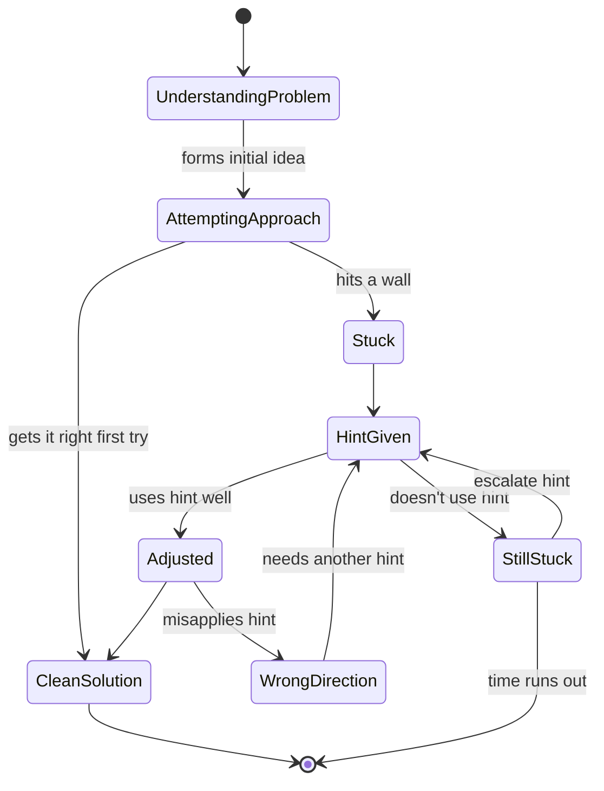

# AI Mock-Interview Platform — Consolidated Spec (v3)

This is the one file to build from. It aggregates everything still valid from earlier passes and reconciles one thing I got wrong: I'd previously cut the periodic checkpoint agent, calling it redundant now that push-to-talk updates criteria every turn. That was wrong -- it serves a different purpose (visibility into idle windows and continuous progress tracking, independent of when turns happen), and it's back in, now formalized as its own named agent alongside the Watchdog.

**Where the diagrams are:** real box-and-arrow visual diagrams (System Architecture, User Flow) were rendered via Excalidraw earlier in the chat -- that's the human-readable, team-shareable version. This file keeps Mermaid versions at the very bottom, in a form Claude Code / Google AI Studio can read as plain text, since those tools parse text more reliably than images.

**Mobile-brief caveat (carried forward):** this is a desktop/web coding-interview experience. Either (a) frame the phone as "the interviewer" companion while a shared laptop shows the code editor, or (b) build responsive and lean into "realistic business capability" in the pitch. Pick (a) if you have 2+ people.

---

## 0. The Three-Agent Architecture

Three coordinated agents, each with a distinct job:

1. **Agent 1 -- Interviewer (push-to-talk, per turn):** the actual conversation. Candidate clicks mic, speaks, clicks again to send. One reasoning call (audio + current code in, reply text + updated criteria JSON out), then one TTS call (reply text in, audio out). This is the core loop from the last pass -- unchanged.

2. **Agent 2 -- Aggregator (periodic, time-interval driven, reinstated):** independent of clicks. Every ~3-5 minutes, fetches the transcript + keystrokes accumulated in that window, sends them to Gemini for a windowed analysis, and stores the result. Repeats for the next window, and the next, for the whole session. At the end, all windows get aggregated into the final feedback. This catches things the per-turn reasoning call can't -- e.g., a long idle window where no turn was sent at all still gets analyzed and logged, not silently skipped.

3. **Agent 3 -- Watchdog (continuous, background, event-driven):** monitors keystroke activity, time since the last turn was sent, and the filler-word ratio from recent turns. If it detects a sustained "stuck" pattern -- **filler words without making progress**, OR **silence and no typing at the same time**, held for a set duration -- it proactively jumps in on its own (a synthetic reasoning+TTS call, not waiting for the candidate to click mic) with a short hint or an unstick phrase.

All three write into one **shared, timestamped session log**. At session end, the Interviewer's per-turn criteria updates and the Aggregator's windowed analyses are merged by a final report call.

---

## 1. Feature List

### 1.1 Session Setup (unchanged)
- Weighted randomizer for problem selection: ~10% easy / ~45% medium / ~45% hard.
- Difficulty persona: Supportive vs Rigorous (different system prompt).
- Session length: 30 or 45 min.

### 1.2 Core UI Layout
- Top: problem statement panel. Bottom: `@monaco-editor/react`.
- Top-right corner: avatar orb, pulses on audio amplitude while a reply plays.
- Mic button (push-to-talk): click to start recording, click again to stop and send. Visible recording-state indicator.
- Criteria matrix panel: updates after every turn (Agent 1) and every checkpoint (Agent 2).

### 1.3 Agent 1 -- Interviewer (per turn)
1. Candidate clicks mic -> `MediaRecorder` captures audio.
2. Clicks again -> stop, produces an audio blob.
3. Frontend bundles `{audio blob, current code text}` -> one reasoning call (`generateContent`, audio + text in) -> returns reply text + updated criteria JSON.
4. Reply text -> a TTS call (`generateContent`, `responseModalities: ['AUDIO']`) -> audio bytes.
5. Frontend plays audio (avatar animates), updates the visible criteria matrix, logs the turn, waits for the next click.

**Latency honesty:** two sequential calls per turn is a bit slower than one integrated stream -- a worthwhile trade for a simpler, lower-risk build.

### 1.4 Agent 2 -- Aggregator (periodic checkpoints, reinstated)
- Fires every ~3-5 minutes, independent of the Interviewer loop.
- Fetches the transcript + keystroke log accumulated since the last checkpoint (including any stretch where no turn was sent at all).
- Sends that window to a small/cheap `generateContent` call for analysis; stores the returned progress signal / updated criteria notes back into the shared log.
- Repeats for the next window until the session ends.
- **Why keep this alongside per-turn updates:** the Interviewer only produces a criteria update when a turn is actually sent. The Aggregator's windowed view still captures long idle stretches, drift across the whole session, and patterns that only show up when you look at a block of time rather than one exchange.

### 1.5 Agent 3 -- Watchdog (stuck-detector, formalized)
Monitors, continuously, in the background:
- **Keystroke activity** -- via Monaco's `onDidChangeModelContent`, always available regardless of turns.
- **Time since the last turn was sent** -- simple timestamp diff.
- **Filler-word ratio of the most recent turn(s)** -- computed once a turn's transcript is available.

**Trigger condition (either):**
- High filler-word ratio with little new technical content across recent turns ("talking but not getting anywhere"), sustained for a set duration, **or**
- No typing **and** no new turn sent (silent and idle at the same time), sustained for a set duration.

**Action:** once sustained past the threshold, the Watchdog jumps in on its own -- a synthetic reasoning+TTS call generating a short hint or an unstick phrase ("try walking me through what you know so far," or a concrete nudge toward the approach) -- without waiting for the candidate to click mic first.

Threshold note: this is a UI-adapted number, not directly from the ~10-15s "live conversation" silence-tolerance research cited below -- push-to-talk has built-in click friction that a continuous stream doesn't, so a longer threshold (tens of seconds, tuned by feel during testing) is more appropriate here.

### 1.6 Hint-Reaction Analysis
Available two ways now: (a) within the Interviewer's per-turn logs (comparing the turn right after a hint to the one before), and (b) within the Aggregator's windowed analysis if the hint and the reaction land in different windows. Both feed the same shared log, so the final report can draw on whichever is complete.

### 1.7 End-of-Session Report
- Final `generateContent` call merges **the Interviewer's per-turn criteria updates** and **the Aggregator's windowed analyses** (not raw audio/transcript) into the structured report.
- Scores out of 5 across 3-5 criteria, filler-word stats (local regex, free), path narrative, verdict.

### 1.8 Difficulty/Persona System (unchanged)
Different system prompt per persona, passed into every Agent 1 reasoning call for the session.

---

## 2. Research Backing

- **Escalating, non-bottom-out hints:** Xiao, Hou & Stamper (CHI LBW 2024) -- vague-first hints are often less useful than worked-example-level hints; backs the Supportive/Rigorous dial and the Watchdog's hint content.
- **Filler words / fluency as a measured interview-performance signal:** MIT/ROC-HCI (Naim et al.) -- speaking rate, filler frequency, and fluency predict human-rated interview scores at correlation >=0.75. Directly backs both the per-turn filler tracking and the Watchdog's "filler without progress" trigger.
- **Silence tolerance in live conversation:** Blind/interview-prep sources (2025-2026) converge on interviewers getting restless around **10 seconds** of silence in continuous conversation. Doesn't transfer directly to a push-to-talk UI (click friction changes the baseline), which is why the Watchdog's threshold is described as UI-adapted rather than directly cited.
- **Honest caveat for the pitch:** paralinguistic scoring (filler words, pace) can penalize accents, non-native speakers, and speech disorders -- present it as a coaching signal, not a hard filter.

---

## 3. Full Tech List

| Layer | Choice | Why / trade-off |
|---|---|---|
| Frontend | React (Vite) | Fastest scaffold |
| Code editor | `@monaco-editor/react` | Real VS Code editor, one install |
| Mic capture | Browser `MediaRecorder` API | Push-to-talk, no streaming infra needed |
| Agent 1 reasoning | Gemini `generateContent`, audio-understanding model | Audio + code in -> reply + criteria JSON |
| Agent 1 voice output | Gemini `generateContent`, `responseModalities: ['AUDIO']` | Reply text -> audio |
| Agent 2 (Aggregator) | Gemini `generateContent`, small/cheap call on a timer (`setInterval`, ~3-5 min) | Windowed transcript+keystroke analysis, repeats independently of turns |
| Agent 3 (Watchdog) | Client-side timers/heuristics (keystroke diff, turn-timestamp diff, filler regex) + a triggered `generateContent`+TTS call when the stuck condition fires | Mostly free; only costs an API call when it actually intervenes |
| ~~Gemini Live API~~ | Dropped from primary plan | Continuous WebSocket/barge-in/proactive-audio not needed now that Agents 1-3 cover the same ground with simpler calls |
| Avatar animation | CSS/canvas circle, amplitude-driven via Web Audio `AnalyserNode` | Zero ML |
| Weighted randomizer | Plain JS, cumulative-weight array | No API needed |
| Session/turn/checkpoint logging | In-memory array / `localStorage` | No database needed |
| Final report | One `generateContent` call merging Agent 1 + Agent 2 outputs | Fast, most scoring already done incrementally |

---

## 4. Three-Hour Timeline

**Hour 1 (spine):**
- Wire Agent 1 end-to-end: click mic -> record -> reasoning call -> TTS call -> play. Get this fully working first.
- Basic UI shell: problem panel, editor, mic button, avatar placeholder, criteria panel.
- One system prompt, one persona.

**Hour 2 (Agents 2 and 3 + polish):**
- Add the weighted randomizer and difficulty toggle.
- Make the avatar pulse with audio amplitude.
- **Add Agent 2 (Aggregator):** a simple `setInterval` firing every ~3-5 min, sending the log segment since last checkpoint to a small `generateContent` call.
- **Add Agent 3 (Watchdog):** keystroke-diff timer + turn-timestamp timer + filler-ratio check; wire the trigger to fire a synthetic reasoning+TTS call when sustained past threshold.

**Hour 3 (report + rehearse):**
- Build the final report call merging Agent 1's per-turn criteria + Agent 2's windowed analyses.
- Simple results screen.
- **Stop building at 3:40, rehearse the demo twice.**

**Cut list, in order, if behind:**
1. Drop Agent 3's spoken nudge -- fall back to a text-only UI prompt when the stuck condition fires.
2. Drop Agent 2 (Aggregator) -- fall back to relying only on Agent 1's per-turn criteria for the final report.
3. Drop the two-difficulty toggle -- ship one persona.
4. **Never cut:** Agent 1's core loop, the code editor, and the final report screen.

**If you only get one thing bulletproof, make it Agent 1's push-to-talk loop.** Agents 2 and 3 are additive layers on top of a working core conversation.

---

## 5. Diagrams (Mermaid, for Claude Code / Google AI Studio to parse as text)

*(Visual box-and-arrow versions of both diagrams below were rendered via Excalidraw earlier in this conversation -- use those for team-facing / human viewing. These Mermaid blocks are the machine-readable equivalents.)*

### 5.1 System Architecture

### 5.2 User Flow

### 5.3 Candidate "path" states (unchanged)

